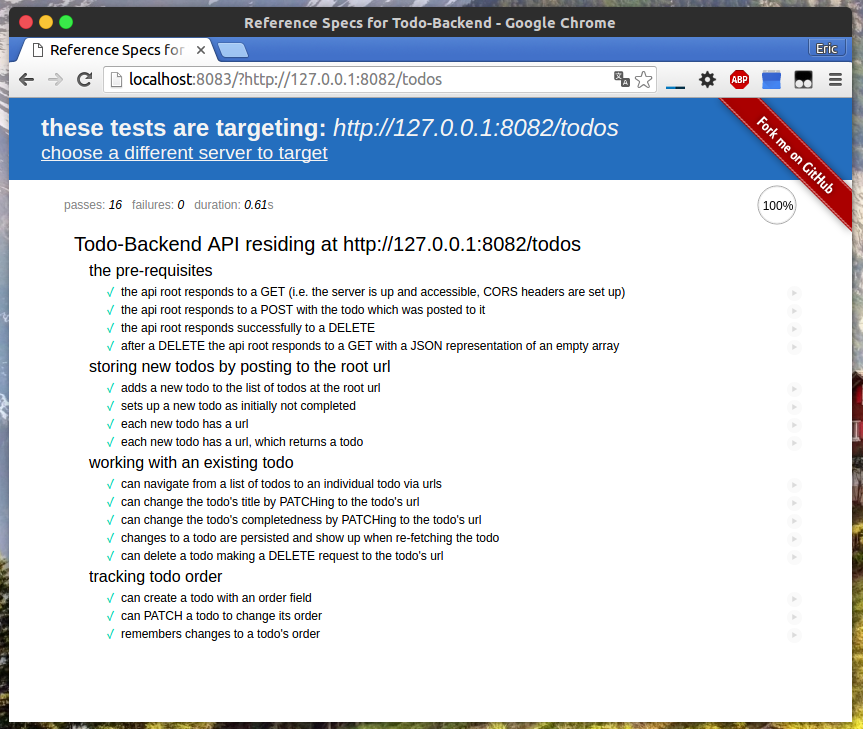

# Todo-Backend-Vert.x
[](https://travis-ci.org/sczyh30/todo-backend-vert.x)

A Todo-Backend implementation using Vert.x, with Redis backend (Vert.x-Redis support).

## RESTful API Route

The Todo-Backend API:

- Add a todo entity: `POST /todos`
- Get a certain todo entity: `GET /todos/:todoId`
- Get all todo entities: `GET /todos`
- Update a todo entity: `PATCH /todos/:todoId`
- Delete a certain todo entity: `DELETE /todos/:todoId`
- Delete all todo entities: `DELETE /todos`

## OpenShift

- [OpenShift Live Demo URL](http://verttodo-sczyh30.rhcloud.com/todos)
- [API Test](http://www.todobackend.com/specs/index.html?http://verttodo-sczyh30.rhcloud.com/todos)
- [Client Test](http://www.todobackend.com/client/index.html?http://verttodo-sczyh30.rhcloud.com/todos)

## Build with Docker

Build command:
```bash
gradle build
docker build -t sczyh30/vert-todo-backend .
```

And then launch:

`docker run -p 8082:8082 -i -t sczyh30/vert-todo-backend`

Then the service will run on `http://localhost:8082`.

## API Test

Test result of the RESTful API (using [todo-backend-js-spec](https://github.com/TodoBackend/todo-backend-js-spec)):

